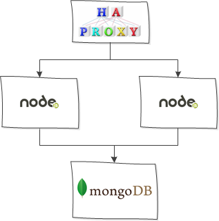

## Roll Your Own Upgrade With A Custom Workflow

One of the differentiators in the marketplace for Cloudify is its ability to automate complex post deployment tasks.  One such task is a rolling upgrade of software in a web server content.  This is a multi-step process that typically involves a coordinated dance between the loadbalancer and the web servers, along with the installation of new content and possibly restarting services.  This post is about a sample implementation of a workflow to automate the process of a zero downtime upgrade of such load balanced resources.

## The Manual Process

It is always a useful (probably essential) exercise in any kind of automation to precisely define the manual steps necessary to accomplish the end goal, and only then attempt automation.  In order to have a more precise description of the process, it is helpful to target a specific technology stack rather than deal in generalizations.  In this simplified walkthrough, we will use our old friend the Nodecellar demo, the [version)(https://github.com/cloudify-cosmo/cloudify-nodecellar-example/tree/3.3.1-build) that includes an HAProxy front end.  The stack looks like:



To perform an upgrade, we'll need to follow this basic algorithm:
* Identify the nodes that we want to upgrade.
* For each node
  * Remove the node from the load balancer
  * Upgrade the node, possibly restarting
  * Add the node to the load balancer

For this example we'll add a few additional requirements (that don't alter the basic algorithm)
* Add a version identifier to the process.  If the version isn't newer than the already deployed s/w, ingnore it.
* During the upgrade process, have each node save the previous version to permit rollback.
* Add a parameter to the upgrade, "percentage", that only upgrades a portion of the candidate nodes (for canary-style deployments).
* Add a parameter to the upgrade, "delay", that will cause a pause between upgrades.

## A Cloudify/TOSCA Oriented Design

TOSCA models deployments as graphs of nodes, which each node being a component that you might desire to orchestrate.  As such, things such as load balancers, web servers, network components ( routers, networks, subnets), security constructs, applications, or really anything else you can think of.  Node types can be created as needed; there is no fixed set of types.  It also defines arbitrary relationships between the nodes, including dependency relationships.  It is this graph of nodes that an "install" workflow traverses, orders, and uses to locate and execute related code (VM creation, for example).
Our model needs a new workflow, we'll call it `webapp_upgrade`.  Workflows have total visibility over the models they operate on.  In this case, we need to operate on a very simple model, as described above.  The workflow will implement the algorithm previously described.  Let's reconsider it with a TOSCA frame of mind:

* **Identify the nodes we want to upgrade.**  TOSCA (and Cloudify naturally) defines a concept of *interface*.  An interface defines operations that can be executed on nodes.  In our case, we will be upgrading applications on web servers, so we'll define a new type called `nodejs.nodes.NodeJSApplicationModule`.  Our new workflow will look for these nodes.  But rather than hard code the node type name in the workflow, we'll define a new interface that the workflow can look for: `webapp_upgrade`.  This interface will define two operations to support the workflow: `upgrade` and `rollback`.
* **For each node**
  * **Remove the node from the load balancer.**  The existence of a load balancer is a given for this workflow.  This implies that there will be a _connected_to_ relationship from the apps to the load balancer.  So in order to remove the node from the load balancer, we'll just execute the operation associated with that relationship that disconnects a balancer target.  Normally this code is only executed by the install process; but we can reuse it to make the workflow less coupled to the implementation.
  * **Upgrade the node, possibly restarting.**  This will be done by the code that will be associated with the new interface we've described.  Recall that the upgrade request may be ignored based on the version.  Since we'll be using the interface, the workflow will have no dependency on the particular algorithm that an implementer might use.  One such detail is whether the web server needs to be restarted, and details about the version id scheme.
  * **Add the node to the load balancer.**  Here we'll resuse the same concept from the "remove node" step.  We'll execute the operation that establishes a link between the load balancer, thereby re-adding it.

## A Cloudify Sample Blueprint Implementation Walkthrough
A sample implementation of the design is [here](http://github.com/cloudify-examples/CHANGE ME).  For the sake of simplicity, it is implemented entirely using the [script plugin](http://docs.getcloudify.org/3.3.1/plugins/script/).  Creating a Cloudify [plugin](http://docs.getcloudify.org/3.3.1/plugins/creating-your-own-plugin) from the code would make it more reusable, if that were needed.  The sample runs on Openstack.
### The Model
The model/blueprint is in the file `openstack-blueprint.yaml`.  Among the node definitions in the `node_templates` section are the two nodes of most interest here: `haproxy` and `nodejs_app`.  The `haproxy` node represents the load balancer we'll need to update, and `nodejs_app` is the application to be updated.  Note that `nodejs_app` has a relationship (`app_connected_to_haproxy`) that connects it to the `haproxy` node.  This is the relationship that the workflow will manipulate.
The `nodejs_app` node has a type of `nodejs.nodes.NodeJSApplicationModule`.  This type is defined in the _types/nodejs.yaml_ file.  Here you can see it derives from a type named `upgradeable_webapp`, and finally `upgradeable_webapp` implements the interface `webapp_upgrade`.  This is the interface discussed earlier that our new workflow will look for.
```yaml
  upgradeable_webapp:
    derived_from: cloudify.nodes.Root
    interfaces:
      webapp_upgrade:
        upgrade: {}
        rollback: {}
```
Back in the `nodejs.nodes.NodeJSApplicationModule`, the implementation for the interface is defined.  We'll go through the implementation later.
```yaml
webapp_upgrade:
  upgrade:
    implementation: "scripts/nodejs/upgrade.py"
    inputs:
      version:
        description: version upgrading to (float)
  rollback:
    implementation: "scripts/nodejs/rollback.py"
```
### The Workflow Definition
The workflow is also defined in the `openstack-blueprint.yaml` file at the bottom:
```yaml
workflows:
  webapp_upgrade:
    mapping: scripts/upgrade_workflow.py
    parameters:
      version:
        description: version of upgraded app.  An float for easy comparison
      url:
        description: location of app
      pause:
        description: number of seconds to pause between each instance upgrade
        default: 0
      percentage:
        description: optional to perform a/b upgrade
        default: 100
      lb_relationship:
        description: the relationship name for the load balancer connection
        default: cloudify.relationships.connected_to
```
The `mapping` key points to the implementation in the `scripts/upgrade_workflow.py` file.  Here we find the algorithm implementation.  The main loop looks at all node instances, and looks for those derived from the specified interface (`cloudify.relationships.connected_to`).
### The Interface Definition and Implementation
In order to make the upgrade process generic, a means of abstracting the upgrading and rollback processes on the target node(s).  In TOSCA, this is done by defining an interface.  The interface here will have two operations (as mentioned earlier): update and rollback.
```yaml
upgradeable_webapp:
  derived_from: cloudify.nodes.Root
    interfaces:
      huawei.interfaces.webapp_upgrade:
        upgrade: {}
        rollback: {}
```
The interface is defined inside a base type (in `blueprint/types/upgrade.yaml`) that concrete implementations (e.g. `nodejs.nodes.NodeJSApplicationModule`) derive from.  The example implementation is for a very specific Nodejs scenario, and simplistic versioning scheme that also involves a file naming convention to identify versions.  The `upgrade` operation is passed the version number and url for the new webapp.  If the webapp is already (or beyond) the specified version, the upgrade request is ignored, otherwise it is honored.  In addition to upgrading, it saves away the current version for potential future rollbacks.  The `rollback` operation simply takes the previously saved version and restores it.  There is only one level of rollback supported in the example.

### The Workflow Implementation
The workflow implementation is in the `scripts/upgrade_workflow.py` file.  The algorithm has been covered above, but a few points of potential interest for aspiring workflow writers are worth covering.
#### Identifying Target Nodes for Upgrade
A key part of the algorithm is figuring out which nodes will be actually upgraded (their upgrade operation called).  In the `get_targets` function, a simple loop discovers the target nodes by looping through the instances:
```python
  for node in ctx.nodes:
    if("webapp_upgrade.rollback" in node.operations):
      for instance in node.instances:
        targets.append(instance)
  return targets
```
Note that workflows have visibility of the entire deployment and all of it's instances.  Contrast this with plugins, which are typically supplied with visibility only on a specific node or node relationship pair.  The logic is a typical nested loop that looks for the "rollback" operation in order to identify the interface.  
#### Processing The Instances
Once the instances have been identified, the main algorithm kicks in.  The first step is to remove target instances based on the supplied `percentage` parameter.  Then each node is upgraded by first removing the node from the load balancer by exploiting the TOSCA relationship and the `cloudify.interfaces.relationship_lifecycle.unlink` interface operation:
```python
    for rel in instance.relationships:
      if(rel.relationship.is_derived_from(p['lb_interface'])):
        ctx.logger.info("unlinking {}\n".format(instance.id))
        ret=rel.execute_target_operation("cloudify.interfaces.relationship_lifecycle.unlink")
        break
```
As mentioned previously, *all* of the deployment is visible via the workflow context, and that includes relationships.
Next the node is actually upgraded by calling the `upgrade` operation:
```python
instance.execute_operation("webapp_upgrade.upgrade",kwargs={"version":p["version"],"url":p["url"]})
```
Note the `version` being passed from the workflow parameters to the actual operation.  After the upgrade of the instance, it is restored to the load balancer by executing the `establish` operation from the `relationship_lifecycle` interface.
#### Rolling Back
The logic for rolling back instances is interleaved in the upgrade logic because the process is virtually identical, except that `rollback` is called instead of upgrade.
## Conclusion
Many discussions about Cloudify revolve around how it can deploy onto multiple cloud platforms in a standards based manner, and perform automated operations such as auto-healing and auto-scaling.  Often the ability of the platform to execute complex custom workflows on previously deployed systems is overlooked.  This post demonstrated the implementation of a generic framework for rolling upgrades, and a specific simple implementation that updates a webapp running on NodeJS.  The example is easily extensible for other load balanced resources, and illustrates the power of custom workflow capability of Cloudify.  The code is available on [github](http://github.com/cloudify-examples/CHANGE ME).  As always, comments are welcome.

